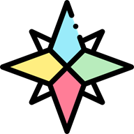

<h1 align="center">
    
  ToGo
</h1>

> :round_pushpin: ToGo é uma PWA que possibilita você buscar, salvar e editar, facilmente, os lugares que precisa ou gostaria de visitar.

Essa micro solução foi desenvolvida com o intuito de exercitar a integração com APIs de mapa e geocoding (`Leaflet` e `Mapbox`), o uso do TypeScript na codificação de componentes e a internacionalização de projetos React (através da biblioteca `react-i18next`).

---

## Screenshots

<h2 align="center">
  
</h2>

---

## Demonstração e Uso do Código

Você pode experimentar essa pequena PWA [neste endereço](https://places-togo.web.app/).

Sinta-se livre para utilizar e estender o código deste repositório, bem como implantar esta solução em um espaço próprio.

_A aplicação foi testada principalmente nos navegadores Chrome (para Linux e Android). Para dificuldades que precisar de ajuda, fique à vontade para usar a seção de issues deste repositório._

---

_A arte original usada como logotipo, o favicon e os demais ícones usados pela aplicação foram feitos por <a href="https://www.flaticon.com/authors/freepik" title="Freepik">Freepik</a> e obtidos em <a href="https://www.flaticon.com/" title="Flaticon"> www.flaticon.com</a>._
